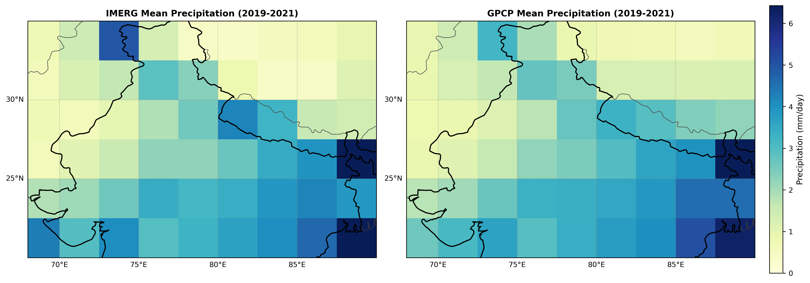
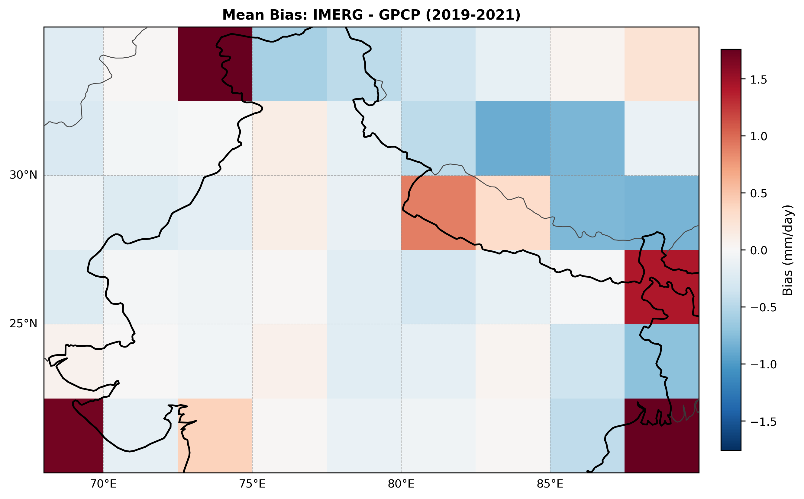
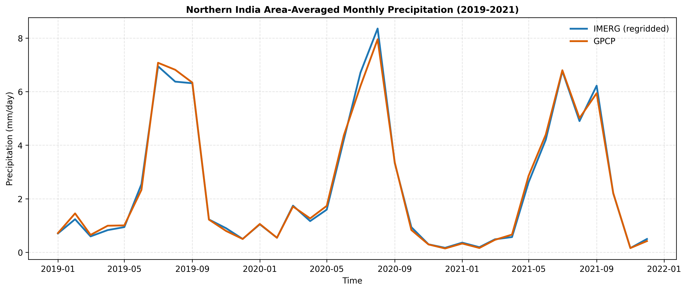
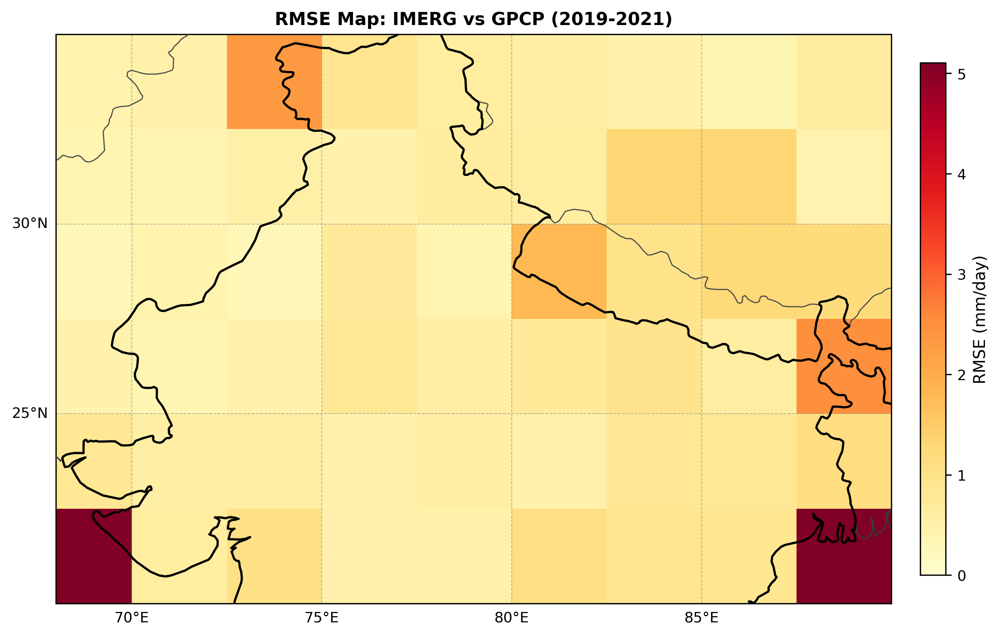
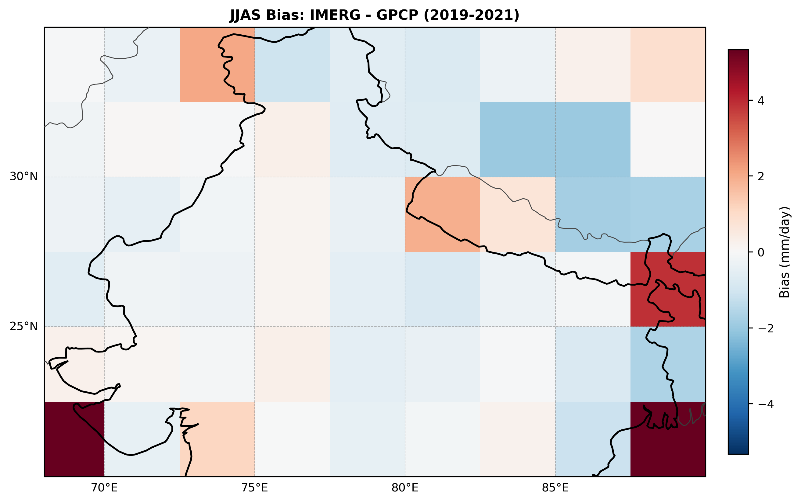

# IMERG vs GPCP Monthly Precipitation Comparison

ESDP final project comparing two monthly precipitation products over Northern India (2019-2021), with a reproducible preprocessing, regridding, evaluation, and plotting workflow.

## 1) Project Motivation and Scope

The motivation for this project comes from prior experience working with precipitation datasets. I was curious about how precipitation estimates translate across regions with very different climatological regimes. IMERG was chosen because it is a widely used, high-resolution satellite-based precipitation product, and this project explores its usefulness at a climatological scale in a familiar region.

Just like IMERG, GPCP is a global precipitation datasets but relies on different observational strategies, with IMERG being satellite-dominated and GPCP incorporating rain-gauge information. They form a natural pair for intercomparison. The goal was not to assume agreement, but to examine whether two fundamentally different approaches to measuring precipitation yield comparable results when aggregated spatially and temporally.

No strong prior assumptions were made about the level of agreement. In fact, the expectation was that the datasets might differ substantially. The results therefore served as a learning outcome in themselves, correcting that initial intuition.

**Region selection**

Northern India was selected both for familiarity and for its strong monsoon-driven precipitation regime. Familiarity with the region allows clearer physical interpretation of spatial and seasonal precipitation patterns, while the pronounced monsoon signal provides a meaningful test case for comparing precipitation products derived from different observational approaches.

**Time period selection**

The analysis period was limited to 2019–2021 to balance scientific relevance with computational feasibility. Initial tests with longer time spans revealed disk I/O and memory constraints during file concatenation and processing of IMERG data. While these issues could be addressed through batching or parallelization strategies, the project scope prioritized a fully reproducible end-to-end workflow over extended temporal coverage.

- Region: 20N to 35N, 68E to 90E (Northern India bounding box)
- Period: January 2019 to December 2021 (36 monthly time steps)
- Objective: compare IMERG and GPCP on a common grid and quantify agreement
- Final analysis unit: mm/day (monthly mean daily precipitation rate)

## 2) Datasets and Data Providers

### IMERG (GPM mission)
- Product family: IMERG Final Run monthly
- Source organization: NASA GPM / NASA GES DISC distribution
- Raw format: HDF5 (group-based)
- Variable used from `Grid` group: `precipitation`
- Native unit used in workflow: mm/hr (converted later)
- Spatial resolution: 0.1° × 0.1°

### GPCP Monthly
- Product family: GPCP Monthly Climate Data Record (v2.3 style file naming)
- Source organization: Global Precipitation Climatology Project (WCRP program; distributed via NOAA/NCEI archive)
- Raw format: NetCDF
- Variable used: `precip`
- Working unit in files: mm/day
- Spatial resolution: 2.5° × 2.5°

## 3) What Was Difficult in Raw Data

The main friction points were structural consistency, not plotting:

- Different file formats (HDF5 vs NetCDF)
- Different coordinate names (`lat/lon` vs `latitude/longitude`)
- Longitude convention mismatch (`-180..180` vs `0..360`)
- Extra bounds coordinates in GPCP files (`time_bnds`, `lat_bnds`, `lon_bnds`)
- Unit mismatch before comparison (IMERG mm/hr vs GPCP mm/day)

The pipeline handles all of these explicitly so the comparison is valid and repeatable.

## 4) Processing Pipeline (What Happens Internally)

A quick look into the project structure:
```text
.
├─ README.md
├─ requirements.txt
├─ data/
│  ├─ raw/
│  │  ├─ imerg_monthly/
│  │  └─ gpcp_monthly/
│  └─ processed/
│     ├─ gpcp_north_india.nc
│     ├─ imerg_north_india.nc
│     ├─ imerg_north_india_mmday.nc
│     ├─ imerg_north_india_on_gpcp_grid.nc
│     ├─ precip.mon.mean.nc
│     └─ regrid_sanity_check_report.json
├─ notebooks/
│  └─ Exploratory-Notebook.ipynb
├─ plots/
│  ├─ area_mean_timeseries.png
│  ├─ jjas_bias_imerg_minus_gpcp.png
│  ├─ mean_bias_imerg_minus_gpcp.png
│  ├─ mean_precip_imerg_vs_gpcp.png
│  └─ rmse_map_imerg_vs_gpcp.png
├─ src/
│  ├─ __init__.py
│  ├─ concatenate_imerg.py
│  ├─ config.py
│  ├─ download_gpcp.py
│  ├─ download_imerg.py
│  ├─ extract_gpcp.py
│  ├─ make_plots.py
│  ├─ regrid_imerg_to_gpcp.py
│  ├─ run_pipeline.py
│  ├─ sanity_check_regrid.py
│  └─ unit_convert_imerg.py
└─ tests/
   └─ test_pipeline_smoke.py
```
Run order is controlled by `src/run_pipeline.py`:
1. `src/download_imerg.py`
   - Checks `data/raw/imerg_monthly/` for IMERG files
   - Dry-run only; does not download unless called with `download=True` and URL list

2. `src/download_gpcp.py`
   - Checks `data/raw/gpcp_monthly/` for GPCP files
   - Dry-run only; does not download unless called with `download=True` and URL list

3. `src/concatenate_imerg.py`
   - Opens all monthly IMERG files from `data/raw/imerg_monthly/`
   - Reads `Grid/precipitation`
   - Applies time and domain subset from `src/config.py`
   - Saves `data/processed/imerg_north_india.nc` as `precip_mm_hr`

4. `src/unit_convert_imerg.py`
   - Converts `precip_mm_hr * 24.0` to `precip_mm_day`
   - Saves `data/processed/imerg_north_india_mmday.nc`

5. `src/extract_gpcp.py`
   - Opens all monthly GPCP files from `data/raw/gpcp_monthly/`
   - Reads `precip`
   - Applies same time/domain subset
   - Drops optional bounds coordinates if present
   - Saves `data/processed/gpcp_north_india.nc` as `precip_mm_day`

6. `src/regrid_imerg_to_gpcp.py`
   - Renames IMERG dimensions to match GPCP
   - Converts IMERG longitude to `0..360` if needed
   - Interpolates IMERG onto GPCP grid using `xarray.interp(..., method="linear")`
   - Saves `data/processed/imerg_north_india_on_gpcp_grid.nc` as `imerg_precip_mm_day`

7. `src/sanity_check_regrid.py`
   - Aligns IMERG and GPCP on common coords/time
   - Checks shape, grid equality, NaN count, value range
   - Computes monthly area-mean bias, MAE, RMSE, and Pearson correlation
   - Saves `data/processed/regrid_sanity_check_report.json`

## 5) Regridding: Why and What It Means

IMERG has a much finer native spatial resolution than GPCP. For direct grid-cell-wise comparison, both datasets must share the same spatial grid. In this project, IMERG is regridded onto the coarser GPCP grid.

Linear interpolation via `xarray.interp` was used for this purpose. This approach smooths sub-grid spatial variability and does not conserve fine-scale precipitation totals, but it is appropriate for monthly, regional-scale intercomparison where large-scale patterns and seasonal variability are of primary interest.

Conservative regridding using xESMF was considered. However, platform-specific dependency constraints on a Windows-based environment prevented reliable installation within the project timeframe. Given the monthly temporal resolution and the emphasis on reproducible workflows, linear interpolation was selected as a robust and portable solution.

So the project regrids IMERG to GPCP coordinates:
- Input IMERG field: `precip_mm_day`
- Target grid: GPCP `latitude`, `longitude`
- Method: linear interpolation
- Result: both arrays become comparable at `(time, latitude, longitude)`

Without this step, bias and RMSE maps would mix mismatched spatial supports and be physically misleading.

## 6) What Is Actually Compared

Final compared variables:
- IMERG regridded: `imerg_precip_mm_day`
- GPCP subset: `precip_mm_day`

Computed diagnostics include:
- Mean precipitation maps
- Mean bias map (`IMERG - GPCP`)
- Area-averaged monthly time series
- RMSE map
- JJAS (June-September) bias map

Colorbar interpretation:
- Mean maps: precipitation rate (mm/day)
- Bias maps: signed difference (mm/day), red = IMERG wetter, blue = IMERG drier
- RMSE map: magnitude of disagreement (mm/day), always non-negative

## 7) Sanity Checks: What They Evaluate

Sanity checks ensure:
- Same grid after regridding
- Same aligned time axis
- No hidden NaN issues
- Comparable value ranges
- Quantified agreement through bias/MAE/RMSE/correlation

This is the quality gate before interpretation and reporting.

Machine-readable sanity-check report:

- `data/processed/regrid_sanity_check_report.json`

## 8) Reproducibility and Scalability

Why reproducible:
- All critical settings are centralized in `src/config.py`
- End-to-end scriptable pipeline (`python -m src.run_pipeline`)
- Deterministic outputs under `data/processed/` and `plots/`
- Basic smoke tests in `tests/test_pipeline_smoke.py`

Why scalable:
- Change period/domain in config and rerun
- Add more years with same raw folder conventions
- Add new metrics/plots without rewriting ingestion
- Extend to other datasets by adding one extraction module plus regridding to a common target grid

## 9) Configuration (`src/config.py`)

Primary knobs:
- `START_DATE`, `END_DATE`
- `LAT_MIN`, `LAT_MAX`, `LON_MIN`, `LON_MAX`
- Input/output paths under `data/raw` and `data/processed`

Changing config and rerunning pipeline regenerates all downstream datasets consistently.

## 10) How to Run

### Step A: Install dependencies
```bash
pip install -r requirements.txt
```
### Step B: Run processing pipeline
```bash
python -m src.run_pipeline
```

### Step C: Generate plots
```bash
python -m src.make_plots
```

### Step D: Optional smoke tests
```bash
python -m pytest -q
```

## 11) Outputs

Processed files:
- `data/processed/imerg_north_india.nc`
- `data/processed/imerg_north_india_mmday.nc`
- `data/processed/gpcp_north_india.nc`
- `data/processed/imerg_north_india_on_gpcp_grid.nc`
- `data/processed/regrid_sanity_check_report.json`

Plots:
- `plots/mean_precip_imerg_vs_gpcp.png`
- `plots/mean_bias_imerg_minus_gpcp.png`
- `plots/area_mean_timeseries.png`
- `plots/rmse_map_imerg_vs_gpcp.png`
- `plots/jjas_bias_imerg_minus_gpcp.png`

## 12) Results Summary (from sanity-check report)

The file `data/processed/regrid_sanity_check_report.json` stores quantitative comparison metrics after alignment on common grid/time.

### Grid/time consistency
- IMERG aligned shape: `[36, 6, 9]`
- GPCP aligned shape: `[36, 6, 9]`
- Common time steps: `36`
- Same latitude grid: `true`
- Same longitude grid: `true`

### Value checks
- IMERG range: `0.0` to `40.9440` mm/day, mean `2.4556` mm/day, NaNs `0`
- GPCP range: `0.0` to `22.5006` mm/day, mean `2.4666` mm/day, NaNs `0`

### Area-mean monthly metrics (IMERG vs GPCP)
- Bias (IMERG - GPCP): `-0.010957` mm/day
- MAE: `0.112487` mm/day
- RMSE: `0.169509` mm/day
- Pearson correlation: `0.997642`

Interpretation: the regional monthly cycle agrees very strongly (high correlation), with very small mean bias and low RMSE at area-mean level.

## 13) Plot Results

### Mean precipitation maps (2019-2021)
Shows long-term spatial pattern consistency between IMERG and GPCP after regridding.



### Mean bias map (IMERG - GPCP)
Shows where IMERG is systematically wetter (positive) or drier (negative) than GPCP.



### Area-averaged monthly time series
Shows temporal agreement of seasonal cycle over Northern India.



### RMSE map
Shows grid-cell-wise magnitude of disagreement through time (always non-negative).



### JJAS bias map
Monsoon-season (June-September) bias pattern between IMERG and GPCP.


## References
**GPCP**:Global Precipitation Climatology Project (GPCP) Monthly Analysis Product data provided by the NOAA PSL, Boulder, Colorado, USA, from their website at https://psl.noaa.gov

**IMERG**: https://gpm1.gesdisc.eosdis.nasa.gov/data/GPM_L3/GPM_3IMERGM.07/

## License

This project is released under the MIT License. See the `LICENSE` file for details.

